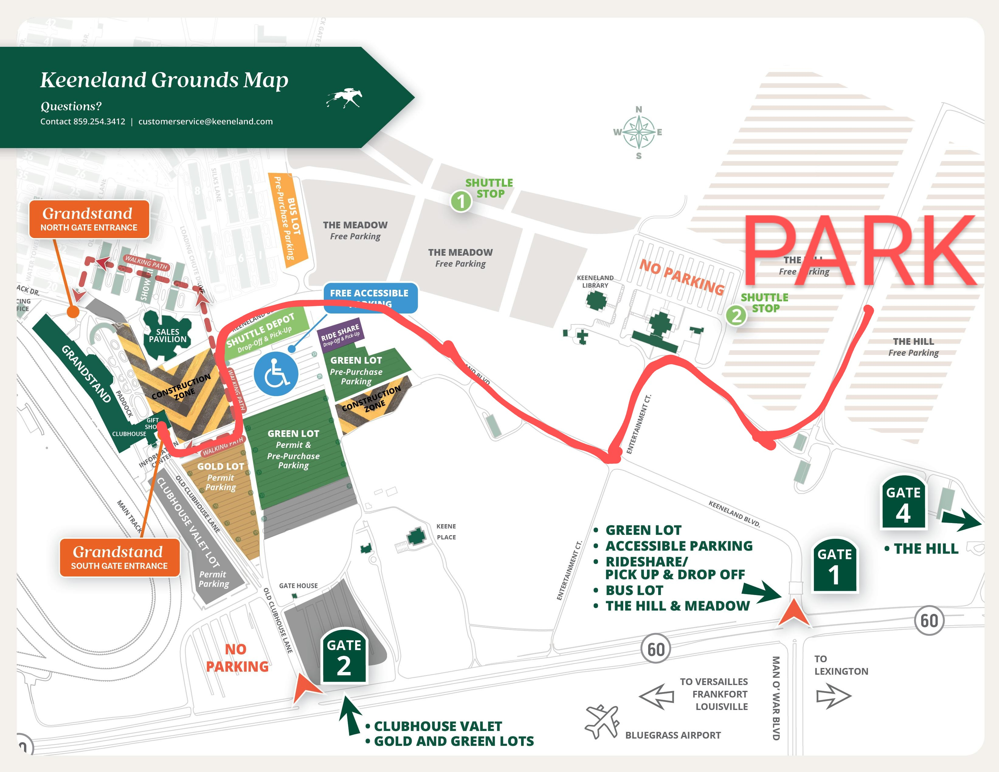

**Current Weather Forecast:**
- Partly cloudy 🌥️
- 63°F Hi (RealFeel 65°F), 42°F Lo
- Light jacket recommended
- [AccuWeather Link](https://www.accuweather.com/en/us/keeneland/40223/daily-weather-forecast/2164419?day=15)

**Overview of Plan:**
- Departing from home at **7:00 AM**
- Parking at **The Hill** (Free Parking – Gate 4)
- Watching races from **12:00–3:30 PM**
- Leaving around **4:00 PM** to head to Cincinnati
- Stop at parents’ house to get ready
- **Couples shower @ 6:00 PM**

## Jump to:
- 🗓️ [Day-Of Schedule](#day-of-schedule)
- 👕 [What to Wear](#what-to-wear)
- 🧾 [Tailgating Checklist](#tailgating-checklist)
- ✅ [Other Suggestions](#other-suggestions)
- 🗺️ [Grounds Map](#grounds-map)
- 💸 [Betting Strategies](#betting-strategies)
  - 🏇 [Elkhorn Stakes (G2)](#elkhorn)
  - 🏇 [Ben Ali Stakes (G3)](#ben-ali)
 - 🧠 [Betting Terminology](#bet-terms)

## 🗓️ Day-Of Schedule

- **7:00 AM** – Leave home
- **9:15–9:30 AM** – Arrive at *The Hill*, park and set up
- **9:30–10:30 AM** – Relax, snacks, music
- **10:30–11:30 AM** – Shuttle/walk to explore Grandstand & paddock
- **12:00–3:30 PM** – Races at *The Hill*
- **4:00 PM** – Depart for Cincinnati
- **~5:00 PM** – Stop to change/freshen up
- **5:45–6:00 PM** – Arrive at brewery for shower

## 👕 What to Wear

- **Top:** T-shirt + flannel / collared shirt and lightweight jacket
- **Bottoms:** Chinos or clean jeans
- **Shoes:** Sneakers or casual boots
- **Extras:** Sunglasses, cap, light layers for morning chill

## 🧾 Tailgating Checklist

### Must-Haves ☝️
- [ ] Cooler with drinks & ice
- [ ] Breakfast/lunch food
- [ ] Folding chairs
- [ ] Blanket or small table
- [ ] Paper towels/wipes
- [ ] Trash bags
- [ ] Portable phone charger
- [ ] Sunscreen & sunglasses
- [ ] Napkins, cups, utensils

### Nice-to-Have 👍
- [ ] Small speaker
- [ ] Cards/games
- [ ] Binoculars
- [ ] Tent or umbrella for shade
- [ ] Race program or app

## ✅ Other Suggestions

- [ ] **Have your ticket** confirmation screenshot or printed
- [ ] **Emergency contact or group chat** if someone gets separated
- [ ] **Bring cash** for food trucks, betting windows, or emergencies.
- [ ] **Choose a meetup spot** at The Hill in case group gets split up.
- [ ] **Bring a blanket or tarp** to sit comfortably on damp grass.
- [ ] **Stick to a 3:45 PM pack-up time** to avoid traffic delays exiting The Hill.
- [ ] **Charge phone the night before** and pack a portable charger with a cable.
- [ ] **Apply sunscreen and bring lip balm**, even if it’s cloudy or cool.
- [ ] **Pack a change of clothes** for the couples shower at Rhinegeist.

## 🗺️ Grounds Map

---

## 💸 Betting Strategies

💰  **Total Wagered:** $88
1. **($42)** G2 Elkhorn Stakes – 1½ mi Turf  
2. **($46)** G3 Ben Ali Stakes – 1⅛ mi Dirt  

⏰ **Note:** These races may occur after your planned 4:00 PM departure — check the final post times if you'd like to stay and adjust plans accordingly.

---

### 🏇 Elkhorn Stakes (G2) – Turf Marathon  

#### 1. [WIN](#win) / [PLACE](#place)
- **$10 Win – Crupi**  
  _G1-tested, thrives at 12f, solid closer_

- **$10 Place – Strong Quality**  
  _Big turf figs, possible lone speed_

#### 2. [EXACTAS](#exacta) 
- **$4 Exacta Key – Crupi over Strong Quality, Gold Phoenix, Highway Robber**  
- **$1 Exacta Box – Crupi, Strong Quality, Gold Phoenix, Highway Robber** ($12)

#### 3. [SHOW HEDGE](#show)
- **$4 Show – Highway Robber**  
  _Consistent finisher, good value_

#### 4. LONGSHOT SPRINKLE  
- **$2 Win / $2 Place – Another Mystery**  
  _Stamina play, live if pace collapses_

---

### 🏇 Ben Ali Stakes (G3) – Dirt Route

#### 1. [WIN](#win) / [PLACE](#place)
- **$10 Win – Bishops Bay**  
  _Tactical, gutsy, ready to fire_

- **$10 Place – Batten Down**  
  _Front-runner, big G3 win last out_

#### 2. [TRIFECTAS](#trifecta) 
- **$2 Trifecta Box – Bishops Bay, Batten Down, First Mission** ($12)  
- **$1 Trifecta Box – Bishops Bay, Batten Down, First Mission, Red Route One** ($12)

#### 3. [EXACTA KEY](#exacta)
- **$2 Exacta Key – Bishops Bay over Batten Down, First Mission**

---

📌 **Notes:**  
- **Crupi** and **Bishops Bay** are key leans.  
- Elkhorn favors stamina/turf form; Ben Ali favors pace/class.  
- Adjust race numbers as post draw is confirmed.
- Adjust plan based on race-day odds.

---

## 🧠 Betting Terminology

New to betting? Here’s a quick rundown of common wager types used in the strategies above:

### **WIN**
- You win if your horse finishes **1st**.
- Example: $10 Win on Crupi means you collect only if Crupi wins.

### **PLACE**
- You win if your horse finishes **1st or 2nd**.
- Lower payout than Win, but safer.

### **SHOW**
- You win if your horse finishes **1st, 2nd, or 3rd**.
- Safest of the three straight bets; smallest payout.

### **EXACTA**
- You pick the **1st and 2nd place finishers in exact order**.
- Higher payout, harder to hit.
- **Box**: Covers all combinations of your picks (e.g., Horse A over Horse B **and** Horse B over Horse A).
- **Key**: One horse must finish 1st, the others can finish 2nd in any order.

### **TRIFECTA**
- You pick the **1st, 2nd, and 3rd finishers in exact order**.
- Big payout, tough to hit.
- **Box**: Covers all combinations of your picks in the top 3.

### **Other Terms**
- **Longshot**: A horse with high odds and low expectations — but potentially high reward.
- **Exacta Box ($1)**: Includes all combos. A 3-horse box = 6 combinations = $6 total.
- **Trifecta Box ($1)**: A 3-horse box = 6 combinations ($6). A 4-horse box = 24 combinations ($24).

### **Tips:**
- Odds are listed as **5-1**, **10-1**, etc. This means you win $5 or $10 for every $1 bet (plus your original bet back).
- You can place bets at teller windows or self-service kiosks at Keeneland.
- You can also bet via apps like TwinSpires or TVG (but may require account setup in advance).

---

[Back to Top](#top)
